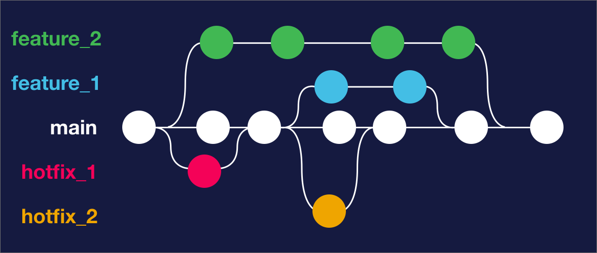
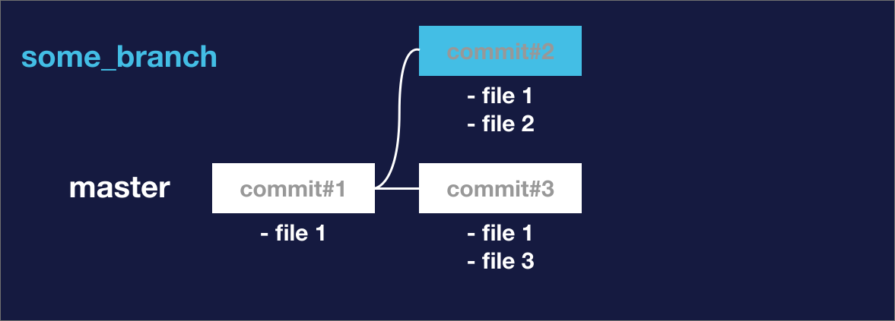
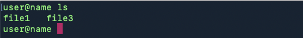
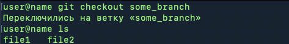
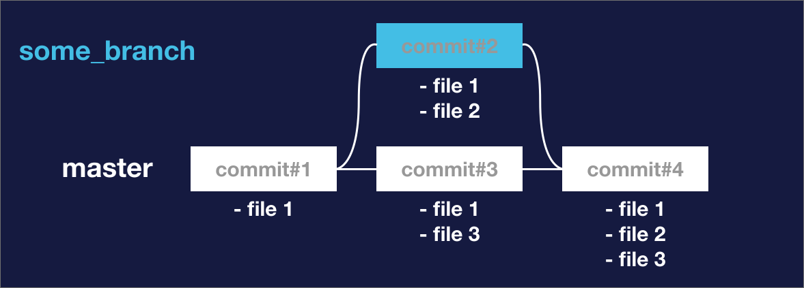
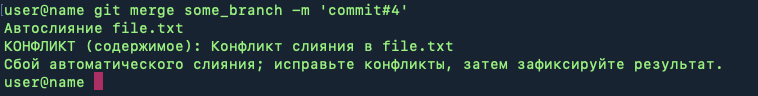
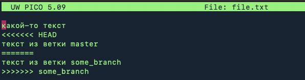

[<< вернуться на главную](./readme.md)

## Что такое ветки и зачем они нужны

</img>

**Ветвление** в Git - один из базовых и основополагающих инструментов.

Важность этого инструмента подчеркивает логотип Git, на котором как раз и изображены стилизованные ветки.

Ветвление позволяет работать над разными частями проекта параллельно, добавлять в него новые функции, исправлять ошибки и все это без нарушения работоспособности основной версии проекта. Кроме того, ветки позволяют работать над проектом одновременно нескольким разработчикам или командам.

Базовую работу веток можно описать на простом примере. Допустим, вы создали веб-приложение, в котором пользователи могут вести дневник спортивных тренировок. Вы запустили сайт и у него уже есть какое-то количество активных пользователей. С самого начала работы над проектом вы использовали Git. История коммитов будет выглядеть примерно так:


У вас есть одно основная ветка - **main** и несколько коммитов в ней.

Теперь вы хотите расширить функционал приложения и добавить возможность для пользователей, помимо дневника тренировок, записывать так же количество съеденных за день калорий. Это существенное изменение функционала, для которого потребуется переработка интерфейса личного кабинета пользователя, добавление новых разделов, создание новых баз данных на сервере и т.п.

Как поступить в таком случае?

Можно начать работу над новым функционалом непосредственно на основной версии сайта, но в этом случае возникнут проблемы у пользователей, которые заходят на него каждый день. Пока вы будете вносить изменения в интерфейс сайта, добавлять новые кнопки и разделы, менять стили оформления, пользователи не смогут нормально использовать сайт, как они привыкли.

Можно работать над новым функционалом на локальной копии сайта, и не отправлять изменения на сервер до тех пор, пока все изменения не будут оттестированы. Но что, если разработка затянется, а вам нужно будет срочно исправить какую-то ошибку на рабочей версии сайта?

Всех этих проблем можно избежать с помощью создания отдельной ветки для работы над новым функционалом:


Создавая ветку, вы как бы создаете еще одну параллельную версию проекта и можете работать над этой версией, не затрагивая работоспособность основного проекта.

Вы можете редактировать существующие функции проекта, добавлять новые и тестировать их работу до того, как добавите их в основной проект.

При этом ваш основной проект может продолжать работать, как ни в чем не бывало, вы так же можете продолжать его поддержку, например, исправлять возникающие ошибки или вносить текущие изменения.

В процессе работы вы можете создавать коммиты, как на основной ветке проекта, так и на ветке, которую вы создали, они могут развиваться параллельно:


В тот момент, когда вы закончите все работы на дополнительной ветке и протестируете ее работу, вы можете *"слить"* ее с основной веткой, таким образом весь созданный вами функционал станет доступен пользователям вашего проекта:


Это самый простой сценарий использования веток. Git не ограничивает вас возможностью создания одной ветки, вы можете создавать сразу несколько веток, которые будут работать независимо друг от друга. Например так:



В проектах, над которыми работает большая команда, ветвление может быть намного более продвинутым. Кроме того, существуют различные методологии ветвления, которые принимаются за основу при работе над большими проектами. Но для базового понимания работы с ветками, будет достаточно примеров, приведенных здесь.

## Создание ветки и переключение между ветками

По умолчанию в Git мы находимся на ветке **master**. Для того, чтобы создать новую ветку и переключиться на работу с ней можно выполнить последовательность команд:

```shell
git branch branch_name
git checkout branch_name
```

Команда *git branch* используется для создания новой ветки. Команда *git checkout* используется для переключения между ветками. Вместо *branch_name* можно написать любое имя, которое будет присвоено ветке. Выполнив эти команды мы создадим новую ветку с заданным именем и переключимся на работу с ней.

Так же есть способ объединить обе эти операции в одну команду:

```shell
git checkout -b branch_name
```

Команда *git checkout* с флагом *-b* одновременно создает новую ветку и переключается на нее.

При необходимости, вы можете переключиться обратно на основную ветку, используя команду

```shell
git checkout master
```

## Слияние веток

Для того чтобы слить две ветки в одну, нужно выполнить команду

```shell
git merge <название ветки для слияния>
```

При этом ветка, название которой вы укажете в команде сольется с той, на которой вы находитесь в данный момент.

Рассмотрим простой пример работы со слиянием веток. Для этого выполним команды:

```shell
mkdir test # создаем папку для тестирования
cd test # переходим в тестовую папку
git init # создаем репозиторий Git в папке
touch file1 # создаем пустой файл для теста
git add file1 # добавляем файл в индекс
git commit -m "commit#1" # создаем первый коммит
```

Мы создали Git репозиторий в тестовой папке, добавили в индекс файл и создали коммит. Схематически наша ветка master сейчас выглядит так:


У нас есть только один коммит, в котором мы добавили тестовый файл.

Теперь создадим новую ветку:

```shell
git checkout -b 'some_branch' # создаем ветку с именем 'some_branch' и переходим на нее
touch file2 # создаем еще один тестовый файл
git add file2 # добавляем его в индекс
git commit -m 'commit#2' # создаем коммит
```

Теперь схема нашего репозитория выглядит так:


У нас появилась отдельная ветка, на которой мы создали коммит и добавили в него еще один тестовый файл. Обратите внимание, что второй тестовый файл в таком случае будет доступен только на ветке some_branch. Если мы вернемся на ветку master, мы не увидим этот файл.

Теперь вернемся на ветку master и добавим коммит с еще одним тестовым файлом.

```shell
git checkout master
touch file3
git add file3
git commit -m 'commit#3'
```

Мы создали еще один коммит, но на основной ветке. Тестовый файл, который мы добавили будет виден только в этой ветке и не будет доступен в ветке some_branch



Мы можем убедиться в этом, выполнив команду для вывода списка файлов:

```shell
ls
```

Мы увидим список файлов:



Поскольку мы находимся на ветке master, мы не можем видеть файл №2, который был добавлен в другой ветке. Если мы переключимся на вторую ветку и запросим список файлов, мы увидим следующее:



Файл file3 недоступен нам т.к. он был создан на ветке master.

Таким образом, все изменения, которые вносятся на отдельных ветках, учитываются только в рамках этих веток и не влияют друг на друга.

Теперь попробуем слить две наши ветки.

```shell
git checkout master # переходим на основную ветку
git merge some_branch -m 'commit#4' # сливаем ветки
```

В команде *git merge* мы указали имя ветки *some_branch*, таким образом указав, что ее нужно слить с текущей веткой *master*. При слиянии веток создается новый коммит, и мы указали описание коммита с помощью флага *-m*.

Теперь схема репозитория выглядит так:



После слияния на ветке *master* теперь доступны все файлы в т.ч. тот, что был создан на отдельной ветке.

## Конфликты

Мы рассмотрели пример, в котором мы работали в рамках разных веток одного проекта над разными файлами.

Но что, если находясь на разных ветках, мы вносили изменения в один и тот же файл?

Рассмотрим такой вариант на примере. Создадим тестовую папку, поместим в нее файл с каким-то тестом, создадим репозиторий Git и добавим этот файл в коммит:

```shell
mkdir test
cd test
echo "какой-то текст" >> file.txt
git init
git add file.txt
git commit -m 'commit#1'
```

Теперь создадим отдельную ветку, добавим еще одну текстовую строку в наш файл и создадим коммит.

```shell
git checkout -b 'some_branch'
echo "текст из ветки some_branch" >> file.txt
git add file.txt
git commit -m 'commit#2'
```

Вернемся на основную ветку и снова отредактируем этот же файл.

```shell
git checkout master
echo "текст из ветки master" >> file.txt
git add file.txt
git commit -m 'commit#3'
```

Таким образом мы отредактировали один и тот же файл, находясь на разных ветках. Что произойдет, если попытаться слить эти ветки:

```shell
git merge some_branch -m 'commit#4'
```
Мы получим такой результат:



Если открыть файл file.txt в тестовом редакторе, мы увидим такую картину:



Указатель <<<<<<<< HEAD указывает на изменения, которые были добавлены в основной ветке. Указатель >>>>>>>> some_branch - на изменения из ветки some_branch. Строка ======== указывают на "центр" места, в котором возник конфликт.

Как решить данную проблему?

В нашем случае необходимо вручную отредактировать текст в файле, приведя его к нужному виду, а затем добавить его в коммит.

```shell
git add file.txt
git commit -m 'commit#4'
```

После этой операции слияние веток будет завершено.

Чтобы не сталкиваться с конфликтами при слиянии веток, нужно стараться организовать работу так, чтобы избегать работы с одними и теми же файлами в рамках разных веток.

Если организовать работу таким образом не получится, удобно будет использовать IDE с поддержкой Git, которые предусматривают намного более удобный интерфейс для работы с конфликтами в рамках одного файла. Кроме того Git содержит в себе много более продвинутых инструментов и приемов для работы с конфликтами, которые помогут решить многие проблемы, но их описание не входит в рамки данной базовой инструкции.

---
[Git Logo](https://git-scm.com/downloads/logos) by Jason Long is licensed under the [Creative Commons Attribution 3.0 Unported License.](https://creativecommons.org/licenses/by/3.0/)