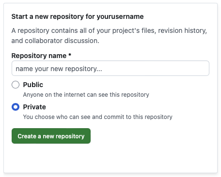

[<< вернуться на главную](./readme.md)

**GitHub** - крупнейший и самый популярный сервис для хостинга проектов и совместной разработки, основанный на Git.

Это незаменимый инструмент для совместной работы над кодом. В данной инструкции будет показан механизм переноса данных проекта Git с локального репозитория на сервер GitHub для открытия доступа к проекту для других разработчиков.

## Подключение

Для начала необходимо пройти регистрацию на портале [github.com](https://github.com/).

После создания учетной записи, переходим главную страницу и видим блок, предлагающий создать новый репозиторий.



Здесь необходимо ввести имя репозитория (любое латинское название, например, "my_project"), выбрать настройки приватности (*Public* - репозиторий доступен другим пользователям, *Private* - только вам и пользователям, которым вы предоставили доступ), затем нажать кнопку "Create a new repository".

После этого вы попадете на страницу, на которой описаны инструкции для подключения.

Этой инструкцией стоит воспользоваться, если вы еще не создали локальный репозиторий проекта у себя на компьютере.

Создайте на компьютере в удобном для вас месте папку, в которой будут храниться файлы проекта и откройте окно терминала по адресу этой папки. Затем выполните ряд команд, которые предлагает вам Github:

```shell
echo "# test" >> README.md # создаем новый файл README.md, который будет использован, как главная страница вашего репозитория на GitHub.
git init # создаем локальный репозиторий Git в папке проекта
git add README.md # добавляем файл README.md в индекс
git commit -m "first commit" # создаем коммит
git branch -M main # меняем имя локальной ветки на main. По умолчанию, новая локальная ветка git называется "master", а на GitHub основная ветка называется "main". Чтобы избежать конфликта, меняем имя локальной ветки 
git remote add origin <ссылка на ваш репозиторий github> # добавляем удаленный репозиторий и присваиваем ему имя "origin"
git push -u origin main # отправляем созданный ранее коммит на репозиторий GitHub
```

После этого настройка удаленного репозитория завершена, вы сможете создавать новые коммиты и отправлять их на GitHub.

## Отправка изменений на сервер

После внесения изменений в фалы проекта и создания коммита, нужно отправить изменения в репозиторий GitHub.

Для этого используется команда 

```shell
git push <remote-name> <branch-name>
```

\<remote-name\> - адрес репозитория.

\<branch name\> - имя ветки.

В нашем случае команда должна выглядеть так:

```shell
git push origin main
```

После ввода команды, все локальные изменения, которые были учтены в коммите будут добавлены в основную ветку удаленного репозитория GitHub.