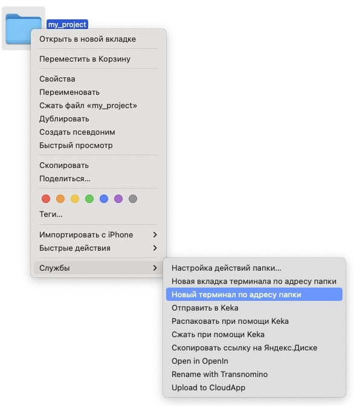
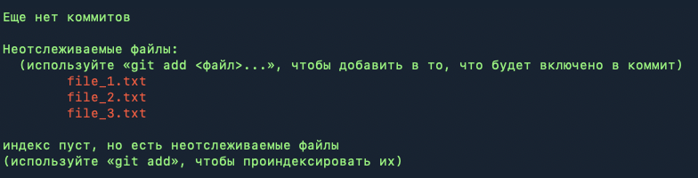
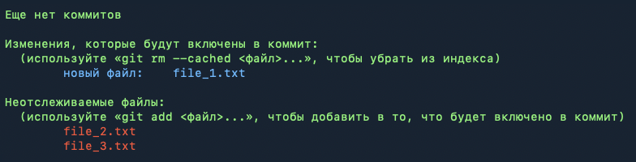

[<< вернуться на главную](./readme.md)

Первое, что нужно сделать при начали работы с Git - создать локальный репозиторий.

**Репозиторий Git** - виртуальное хранилище, в котором содержатся все данне проекта. В нем будут храниться все актуальные файлы, а так же история их версий.

## Создание репозитория

Для начала необходимо создать директорию, в которой будут расположены файлы проекта и открыть ее в терминале. На macOS проще всего это сделать кликнув второй кнопкой мыши на нужной директории и выбрав "Службы" -> "Новый терминал по адресу папки".



В терминале выполняем команду

```shell
git init
```
Таким образом мы создали новый репозиторий Git. В папке с нашим проектом появится скрытая директория ".git" в которой содержаться все настройки и описание репозитория.

## Файл .gitignore

При работе Git отслеживает изменение только тех файлов, которые были добавлены в индекс. Помимо отдельных файлов в индекс можно добавлять так же папки или всю директорию с проектом целиком.

При этом в ней могут содержаться файлы, которые мы не захотим добавлять в индекс. Это могут быть различные системные файлы, временные или любые другие файлы, которые мы по какой-то причине не захотим добавлять в индекс.

Для этого существует файл **.gitignore**, в котором перечислены файлы или каталоги, которые не должны попадать в индекс.

### Создание .gitignore

Для того чтобы создать файл .gitignore, откроем папку с проектом и выполним команду

```shell
touch .gitignore
```
Чтобы убедиться, что файл создан корректно выполним команду

```shell
ls -la
```

Команда покажет список файлов в директории с нашим проектом, среди них мы должны увидеть .gitignore.

### Заполнение .gitignore

Содержимое файла .gitignore влияет на то, какие файлы будут исключены из индекса. Помимо указания конкретных файлов мы так же можем использовать маски или исключать из индекса целые каталоги. При заполнении .gitignore можно использовать следующие команды:

| Команда      | Значение          |
|--------------|-------------------|
| filename.txt | имя файла целиком |
| /folder/     | имя директории     |
| * | заменяет любое количество символов. Например, если мы хотим убрать из индекса все файлы с расширением .txt, мы можем написать **.txt* |
| ? | заменяет один любой символ |
| ** | заменяем любое количество подкаталогов. Например ***/folder* |
| ! | применяется для ивертирования правила. Например, в директории содержится большое количество файлов файлов с расширением .txt, мы хотим убрать все эти файлы из индекса, кроме одного. Для этого мы можем создать два привила **.txt* и *!filename.txt*. Тогда из всех файлов с расширением .txt в индекс попадет только один файл filename.txt |
| / | используется для применения правила только к файлам в той же директории, в которой содержится .gitignore, а так же для разделения уровня каталогов |
| \ | применяется для экранирования спецсимволов |

Для примера добавим несколько полезных исключений в .gitignore. Редактировать .gitignore можно в любом текстовом редакторе, IDE или прямо в терминале. Используем последний способ и откроем файл с помощью встроенного в терминал редактора *nano*:

```shell
nano .gitignore
```

Добавим в него скрытые папки, которые создает macOS в каждой директории, в которой хранятся настройки папок. Для этого добавим него две строки:

```
.DS_Store
**/.DS_Store
```

Таким образом из индекса будут удалены все файлы *DS_Store*, которые хранятся в корневом каталоге и во всех подкаталогах.

После этого нажмем сочетания клавиш <kbd>control</kbd> + <kbd>O</kbd>, чтобы сохранить изменения и <kbd>control</kbd> + <kbd>X</kbd> чтобы закрыть редактор.

## Добавление файлов в индекс

Для того, чтобы добавить файлы в индекс, используется команда

```shell
git add
```

Можно добавлять в индекс отдельные файлы, например

```shell
git add filename.txt
```

Категории

```shell
git add folder/
```

Так же можно использовать маски

```shell
git add *.txt
```

## Просмотр состояния

Для просмотре текущего состояния файлов в индексе используется команда

```shell
git status
```

Красным цветом будут отмечены файлы, которые не добавлены в индекс и не отслеживаются, синим цветом - файлы в индексе.

Пример: В каталоге содержится 3 файла. Мы не добавляли их ви индекс. После ввода команды *git status* мы увидим:



Теперь добавим файл *file1.txt* в индекс с помощью команды

```shell
git add file_1.txt
```

После этого снова выполним

```shell
git status
```

Теперь мы видим



Таким образом мы видим, что файл был успешно добавлен в индекс.

## Делаем коммит

**Коммит** *(от англ commit - "фиксировать")* - это способ сохранения изменений в Git. Создавая коммит мы фиксируем все созданные до этого момента изменения в файлах, которые участвуют в индексе.

Перед создание коммита нелишним будет проверить состояние файлов с помощью команды *git status*, работа с которой описана в предыдущем разделе.

Для создания коммита нужно выполнить команду

```shell
git commit -m "description"
```

Флаг *-m* добавляет описание коммита, которое необходимо записать внутри скобок. В описании нужно коротко указать на изменения, которые были произведены над файлами проекта.

Описание должно быть коротким, но ёмким. Правильным подходом будет использование латиницы и английского языка при описании коммита.