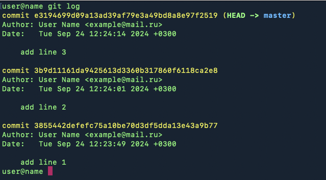
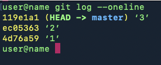
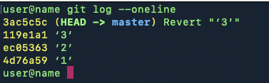
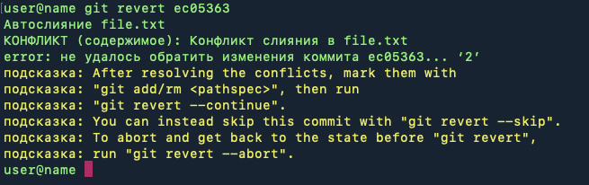

[<< вернуться на главную](./readme.md)

## Откат файлов к предыдущему состоянию

В процессе работы над проектом часто может возникать ситуация, при которой вам нужно отменить изменения, которые вы внесли в файлы. Если файлы добавлены в индекс, Git запоминает все состояния файлов и все изменения, которые были внесены в них с момента первого коммита.

Git предоставляет большое количество инструментов для работы с восстановлением файлов, здесь мы рассмотрим только основные ситуации, которые могут возникнуть в процессе работы.

### Ситуация 1: вы изменили файл, но не обновили его индекс командой git add

В этом случае будет достаточно выполнить команду

```shell
git checkout <file>
```

Все изменения в файле будут восстановлены до состояния на момент последнего коммита.

### Ситуация 2: вы изменили файл, и обновили индекс командой git add

В этой ситуации нужно будет выполнить команды

```shell
git reset <file>
git checkout <file>
```

Команда *git reset* удалит файл из индекса, *git checkout* вернет его к предыдущему состоянию.

### Ситуация 3: вы изменили файл, обновили индекс и сделали коммит

Если файл уже был добавлен в коммит, мы можем откатить его состояние до любого коммита, в котором этот файл участвовал.

Рассмотрим ситуацию на примере. Создадим тестовый файл в директории и добавим в него одну строку с текстом.

```shell
echo "Строка 1" >> file.txt
```

Поле этого добавим файл в индекс и сделаем коммит

```shell
git add file.txt
git commit -m 'add line 1'
```

Теперь добавим еще две строки в файл и после добавления каждой строки будем делать коммит

```shell
echo "Строка 2" >> file.txt
git add file.txt
git commit -m 'add line 2'
echo "Строка 3" >> file.txt
git add file.txt
git commit -m 'add line 3'
```

В итоге у нас получилось 3 коммита, в каждом из которых в файл добавлялась одна новая строка.

Допустим, мы хотим откатить изменения в файле до состояния в котором он был на момент второго коммита.

Первое, что нам нужно сделать - узнать хеш-сумму нужного нам коммита. Для этого нужно выполнить команду

```shell
git log
```

Мы увидим всю историю наших коммитов.



В строке после слова commit мы видим хеш-сумму каждого коммита. Она используется как уникальный номер коммита в случае, если нам нужно указать на него. Как правило, не обязательно указывать всю сумму целиком, достаточно использовать только первые 6 символов.

Мы хотим откатить файл до состояния, в котором он был на момент второго коммита. Для этого выполним команду:

```shell
git checkout 3b9d11 -- file.txt
```

Мы указали первые 6 символов хеш-суммы нужного коммита и название нужного нам файла. После этого файл вернется в состояние на момент коммита №2.

Эту команду так же можно использовать для восстановления нескольких файлов:

```shell
git checkout <hash> -- file_1.txt file_2.txt
```

Так же можно восстанавливать директории или группы файлов, с использованием масок

```shell
git checkout <hash> -- *.txt ./folder
```

## Отмена всех изменений, сделанных в коммите

В предыдущем разделе описан способ восстановления конкретного файла, либо групп файлов. Но часто может возникнуть ситуация, когда нужно отменить все изменения, сделанные в последнем коммите или нескольких коммитах. Сделать это можно несколькими разными способами.

### Команда git reset

Команда **git reset** может "перемотать" изменения в истории коммитов на один или более шагов.

Первый способ использования этой команды - указать количество шагов, на которые нужно откатиться назад:

```shell
git reset HEAD~1
```

Команда, приведенная выше, откатит изменения на 1 шаг назад, т.е. удалит последний коммит. При этом сам коммит так же пропадет из истории коммитов.

Второй способ - указать на конкретный коммит, при помощи его хеш-суммы. Например так:

```shell
git reset 3b9d11
```

В этом случае все коммиты, которые идут после 3b9d11 будут удалены.

У этой команды есть несколько режимов работы.

```shell
git reset --soft HEAD~1
```

Команда в режиме **--soft** удалит последний коммит, но не будет трогать изменения в файлах и оставит их в индексе.

```shell
git reset --mixed HEAD~1
```

Режим **--mixed** используется по умолчанию, т.е. его не обязательно явно указывать при выполнении команды reset, можно просто написать

```shell
git reset HEAD~1
```

В этом режиме коммит будет удален, изменения в файлах не будут затронуты, но файлы будут удалены из индекса.

И последний вариант:

```shell
git reset --hard HEAD~1
```

В режиме **--hard** так же будет удален последний коммит, файлы будут исключены из индекса и все изменения в файлах, а так же новые добавленные файлы будут удалены.

Использовать режим --hard нужно очень осторожно т.к. изменения, которые он производит необратимы.

### Команда git revert

Команда **git revert** имеет похожий функционал, но имеет ряд важных отличий.

* в отличие от git reset, она не затрагивает историю коммитов
* все изменения, которые сделает git revert будут оформлены в виде нового коммита
* эта команда не отменяет действия коммитов, которые находятся между HEAD и коммитом, который вы укажете в revert, поэтому могут возникать конфликты

Эту команду полезно будет использовать, если вам не хочется нарушать историю коммитов, удаляя все коммиты, до того, к которому вы хотите откатиться. Так же она используется в случае, если нужно исправить ошибку, совершенную в одном из прошлых коммитов, не затрагивая изменения, которые были внесены после него.

Пример:

Создадим текстовый файл, в котором есть 3 строки. После добавления каждой строки будем делать коммит.

```shell
echo «строка 1» >> file.txt
git add .
git commit -m ‘1’
echo «строка 2» >> file.txt
git add .
git commit -m ‘2’
echo «строка 3» >> file.txt
git add .
git commit -m ‘3’
```

Посмотрим историю коммитов



Выполним команду git revert с указанием хеш-суммы последнего коммита, чтобы отменить изменения, которые были внесены им.

```shell
git revert 119e1a1
```

После ввода команды откроется текстовый редактор для ввода сообщения, которое будет применено к новому коммиту, который будет создан командой git revert. Это аналогично команде -m, которую мы используем в git commit.

После ввода сообщения мы можем снова посмотреть историю коммитов.



Мы видим, что в истории появился еще один коммит, который отменил изменения коммита №3. Текст, который был добавлен в file.txt на третьем коммите так же исчез.

Но что, если мы попробуем применить git revert не для последнего коммита, а для того, который был раньше?

Чтобы отменить изменения, сделанные git revert выполним

```shell
git reset --hard HEAD~1
```

Посмотрим лог и увидим, что изменения, внесенные git revert были удалены, мы снова видим свои 3 коммита:


Теперь выполним git revert, но укажем хеш не последнего коммита, а второго

```shell
git revert ec05363
```

Мы получим конфликт:



Почему возникает конфликт? Git revert, в отличие от git reset не отменяет *все* изменения в файлах по цепочке до указанного коммита. Эта команда удаляет только изменения, внесенные конкретным коммитом. Поскольку в файл так же вносились изменения последующими коммитами, возникает конфликт.

Поэтому в этом случае нам остается только вручную исправить конфликты и сделать новый коммит.


